## Advanced Lane Detection


---

**Advanced Lane Finding Project**

The goals / steps of this project are the following:

* Compute the camera calibration matrix and distortion coefficients given a set of chessboard images.
* Apply a distortion correction to raw images.
* Use color transforms, gradients, etc., to create a thresholded binary image.
* Apply a perspective transform to rectify binary image ("birds-eye view").
* Detect lane pixels and fit to find the lane boundary.
* Determine the curvature of the lane and vehicle position with respect to center.
* Warp the detected lane boundaries back onto the original image.
* Output visual display of the lane boundaries and numerical estimation of lane curvature and vehicle position.

## [Rubric](https://review.udacity.com/#!/rubrics/571/view) Points

### Here I will consider the rubric points individually and describe how I addressed each point in my implementation.  

### Camera Calibration


The code for this step is contained in lines 7 through 39 of the file called `camera_calibration.py`.  

I start by preparing "object points", which will be the (x, y, z) coordinates of the chessboard corners in the world. Here I am assuming the chessboard is fixed on the (x, y) plane at z=0, such that the object points are the same for each calibration image.  Thus, `objp` is just a replicated array of coordinates, and `objpoints` will be appended with a copy of it every time I successfully detect all chessboard corners in a test image.  `imgPoints` will be appended with the (x, y) pixel position of each of the corners in the image plane with each successful chessboard detection.  

I then used the output `objpoints` and `imgpoints` to compute the camera calibration and distortion coefficients using the `cv2.calibrateCamera()` function.  I applied this distortion correction to the test image using the `cv2.undistort()` function and obtained this result shown on the right image in comparison with tyhe original image shown on the left: 

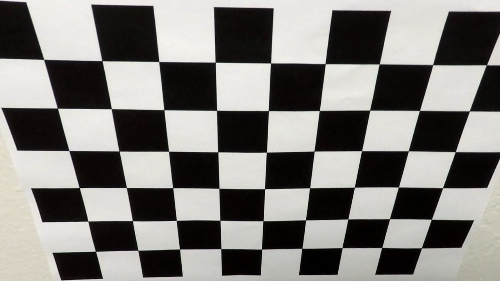.

### Pipeline (single images)

#### 1. Correct the distortion of the camera from the images.

To demonstrate this step, I will describe how I apply the distortion correction to one of the test images like this one:

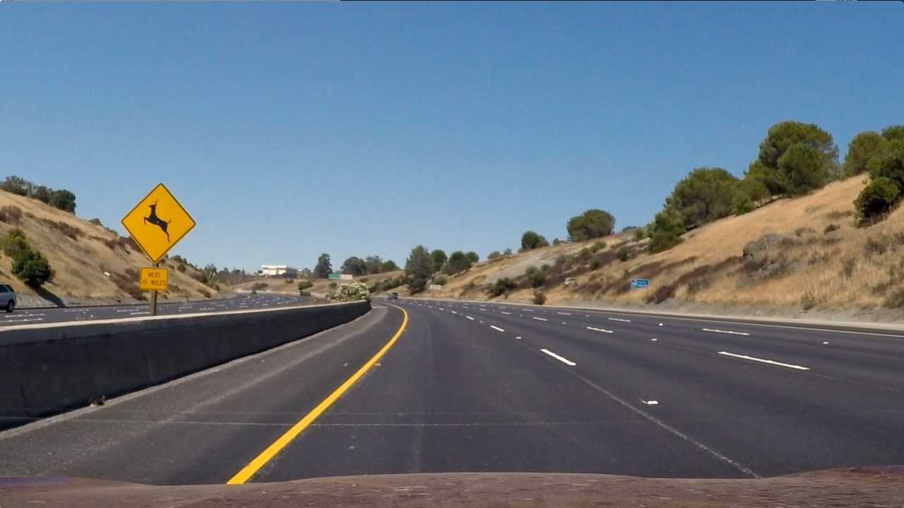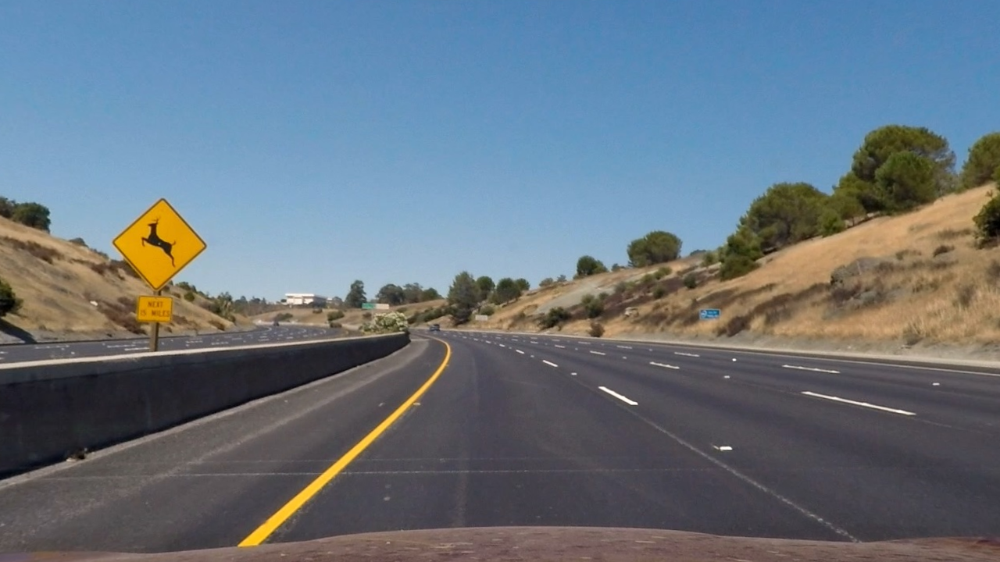.

#### 2. Describe how (and identify where in your code) you used color transforms, gradients or other methods to create a thresholded binary image.  Provide an example of a binary image result.

I implemented a combination of color and gradient thresholds to generate a binary image. The gradient  thresholding was implemented at file `sobel.py` and the color at file `color_masks.py`.


**2.1 Color Masks Detection Pipeline**

This pipeline consist in extract the white and yellow information from the image restrict the area of interest and find the lines that lays within its points.

The first step is to use the inRange method to filter only a certain range of colors within the image. The chosen range is from  [190, 200, 200] to [255, 255, 255] as seen in the code below.

```python
def white_mask(original):
    lower_white = np.array([190, 200, 200])
    upper_white = np.array([255, 255, 255])

    white = cv2.inRange(original, lower_white, upper_white)

    mask = np.zeros_like(white)

    mask[white > 0] = 1

    mask = np.asarray(mask, np.float)
    
    return mask
```
The result is an image similar to the image below.

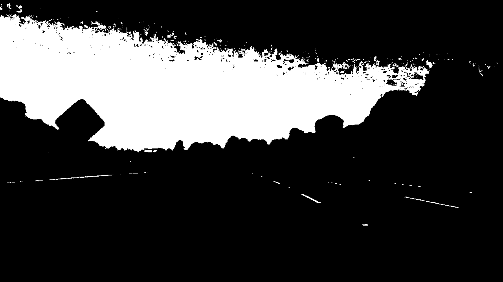

The second step is to extract yellow information from the image, this was a little trickier than the white mask, as it was not givan a good result using RGB/BGR image only. The solution was use two techniques the rgb filter and to convert the image from BGR to HSV (Hue, Saturation Value) and then use the range from [0, 90, 100] to [80, 255, 255]) on the hsv image. The code below and the image shows the result obtained by this method.

```python
def yellow_mask_rgb(original):
    """
    Create a mask from the yellowish pixels of the frame
    """
    original = cv2.cvtColor(original, cv2.COLOR_BGR2RGB)

    lower_yellow = (230, 120, 0)
    upper_yellow = (255, 255, 180)

    yellow = cv2.inRange(original, lower_yellow, upper_yellow)

    # cv2.imshow('Yellow', yellow)

    mask = np.zeros_like(yellow)

    mask[yellow > 0] = 1
    mask = np.asarray(mask, np.float)

    return mask


def yellow_mask_hsv(original):
    """
    Create a mask from the yellowish pixels of the frame
    """

    HSV = cv2.cvtColor(original, cv2.COLOR_BGR2HSV)

    lower_HSV = (00, 90, 100)
    upper_HSV = (80, 255, 255)

    yellow_HSV = cv2.inRange(HSV, lower_HSV, upper_HSV)

    mask = np.zeros_like(yellow_HSV)

    mask[yellow_HSV > 0] = 1

    mask = np.asarray(mask, np.float)

    return mask


def yellow_mask(original):
    """
    Create a mask from the yellowish pixels of the frame, combining RGB mask and HSV mask
    """

    hsv = yellow_mask_hsv(original)
    rgb = yellow_mask_rgb(original)

    mask = np.zeros_like(rgb)
    mask[(hsv == 1) | (rgb == 1)] = 1

    return mask
```

The RGB yellow mask gives the left image below and the HSV mask gives the right image:

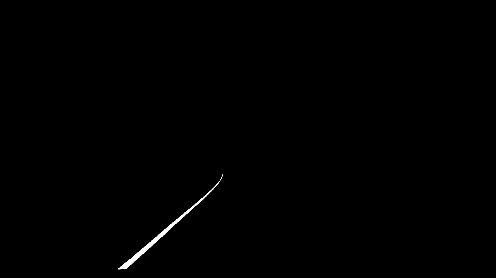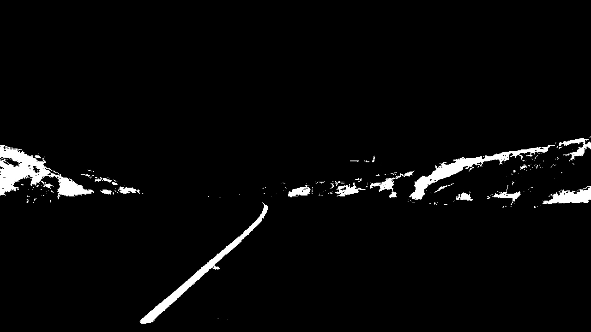


Combining these 2 images we get:
<center>

</center>

Here's an example of my output for the white and yellow masks.
<center>
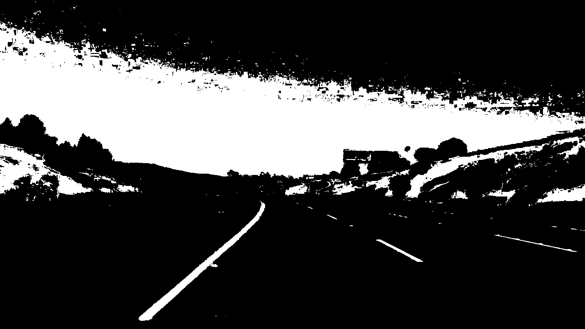.
</center>


**2.1 Sobel Gradient Pipeline**

Sobel is a differentiation operator that calculates the derivatives from the image. Getting an binary image from the horizontal derivatives results in an image as seen below:

<center>
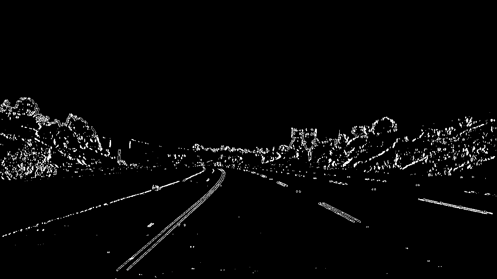.
</center>

And the vertical derivative results in:

<center>
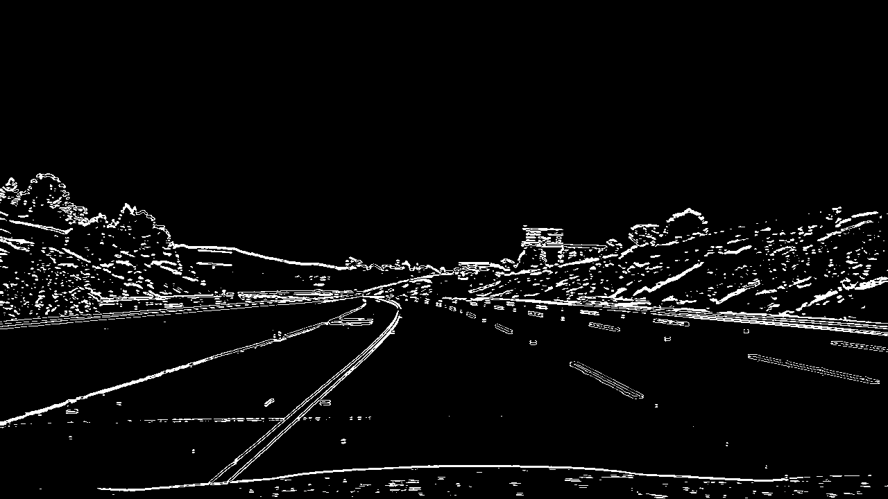.
</center>

The gradient is the square root of the sum of the squared x and y gradients, as seen in the equation below:

$$G=√Gx²+Gy²$$

The resulting image of the gradients is shown below:

<center>
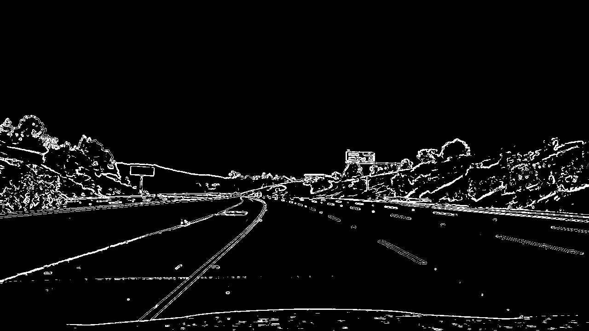.
</center>

The direction of the gradients are calculated by the equation $arctan(sobely/sobelx)$ and the resulting image is:


<center>
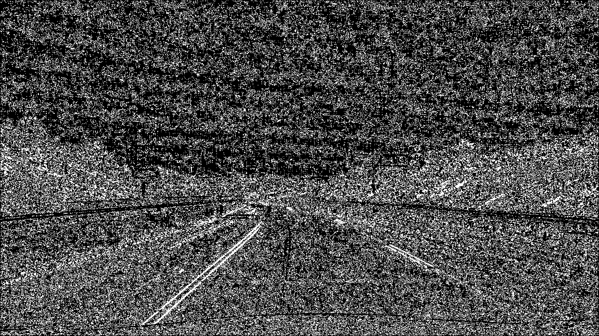.
</center>

The last step was to combined all the images doing a `bitwise and` for sobel horizontal (x) and vertical (y) with a `bitwise or` with the result of a `bitwise and` of magnitude and direction, as shown in the code below:

```python
combined[((gradx == 1) & (grady == 1)) | ((mag_binary == 1) & (dir_binary == 1))] = 1
```


<center>
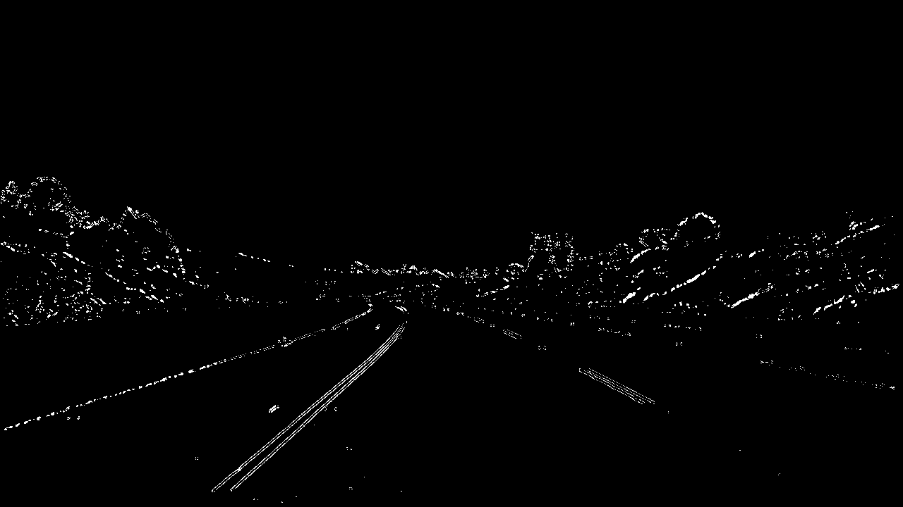.
</center>

After several tests the sobel images was not used on final solution, because it was making the line very thick and thus interfering on the calculations of the line equation.

#### 3. Bird-eye - Warping Image

The code for my perspective transform includes a function called `warp_transformation`, which appears in lines 53 through 98 in the file `lane_detection.py`.  The `warp_transformation()` function takes as inputs an image (`maskedImage`) and opyionally the undistorted color image. I chose the hardcode the source and destination points in the following manner:

```python
d_left_corner = 238
u_left_corner = 586
u_right_corner = 695
d_right_corner = 1070

src = np.float32([
    [d_left_corner, 690],
    [u_left_corner, 455],
    [u_right_corner, 455],
    [d_right_corner, 690]
])

dst = np.float32([
    [320, 720],
    [320, 0],
    [920, 0],
    [920, 720],
])
```

This resulted in the following source and destination points:

| Source    | Destination |
| :-------: | :---------: |
| 238, 690  | 320, 720    |  |
| 586, 455  | 320, 0      |
| 695, 455  | 920, 0      |
| 1070, 690 | 920, 720    |


I verified that my perspective transform was working as expected by drawing the `src` and `dst` points onto a test image and its warped counterpart to verify that the lines appear parallel in the warped image.


<center>
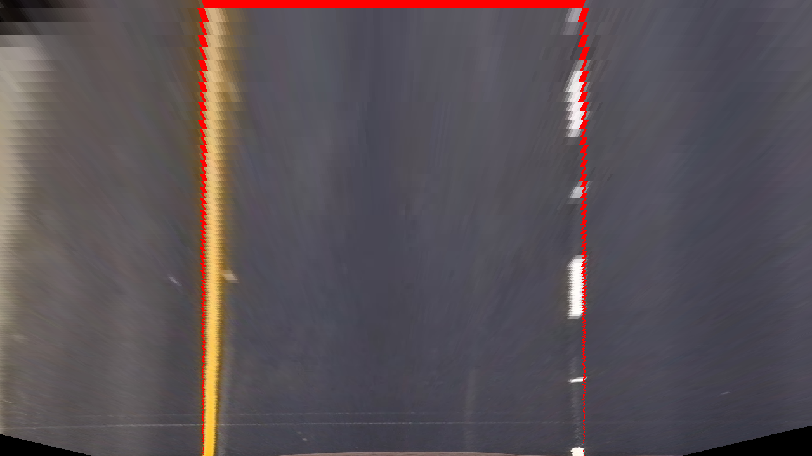.
</center>


#### 4. Identifying the lanes and fit a second order polynomial

To find the lanes first we defines how many windows our search will split the image vertically, then we localise the two peaks on the histogram of the lower window. We repeat this on all windows. In the final solution a total of 20 windows was chosen.

All non-zero pixels inside close to the peak area are found and used on functions `np.polyfit()` on line 178 of the same file, to find the second order polynomial parameters.

Once we find the first fit, we then uses a faster functions to look only close to that line. The funtion is `calc_fits_from_previous()`.

The result of the search is shown below:

<center>
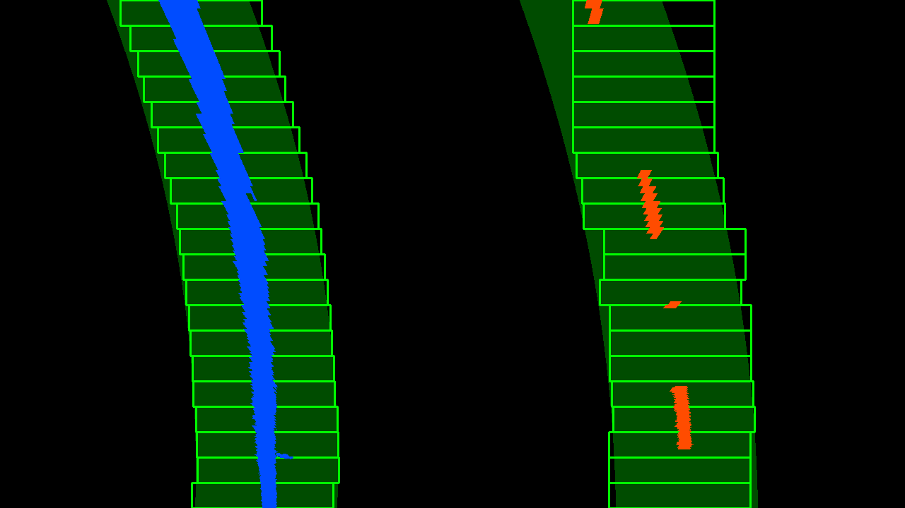.
</center>


#### 5. Curvature

The curvature is calculated for the left and the right lanes on function `calc_curvature()` in the file `lane_detection.py` and it is shown below.

```python
def calc_curvature(self):

        y_eval = np.max(self.ploty)

        # Fit new polynomials to x,y in world space
        left_fit_cr = np.polyfit(
            self.lefty*self.ym_per_pix, self.leftx*self.xm_per_pix, 2)
        right_fit_cr = np.polyfit(
            self.righty*self.ym_per_pix, self.rightx*self.xm_per_pix, 2)

        # Calculate the new radii of curvature
        self.left_curverad = (
            (1 + (2*left_fit_cr[0]*y_eval*self.ym_per_pix + left_fit_cr[1])**2)**1.5) / np.absolute(2*left_fit_cr[0])
        self.right_curverad = (
            (1 + (2*right_fit_cr[0]*y_eval*self.ym_per_pix + right_fit_cr[1])**2)**1.5) / np.absolute(2*right_fit_cr[0])
        #Mean between left and right curvature
        self.curvature = (self.left_curverad + self.right_curverad) / 2
```

The function uses the equation below:

<center>
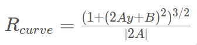.
</center>

#### 6. Result

I implemented this step in lines 276 through 324 in my code in `lane_detection.py` in the function `draw_final_image()`.  Here is an example of my result on a test image:

<center>
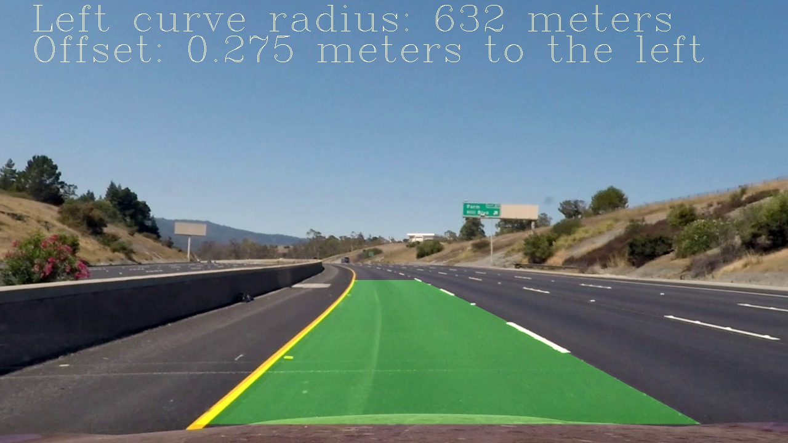.
</center>

---

### Pipeline (video)

Here's a [link to my video result](https://www.youtube.com/watch?v=ouulQvS2WNA)

---

### Discussion

The hardest part was to define a good source points for the warp functions, as it is the base for the radius calculation. 

One thing could be done to improve the overall result is processing the binary images after the warp function, trying to prevent more deformation.